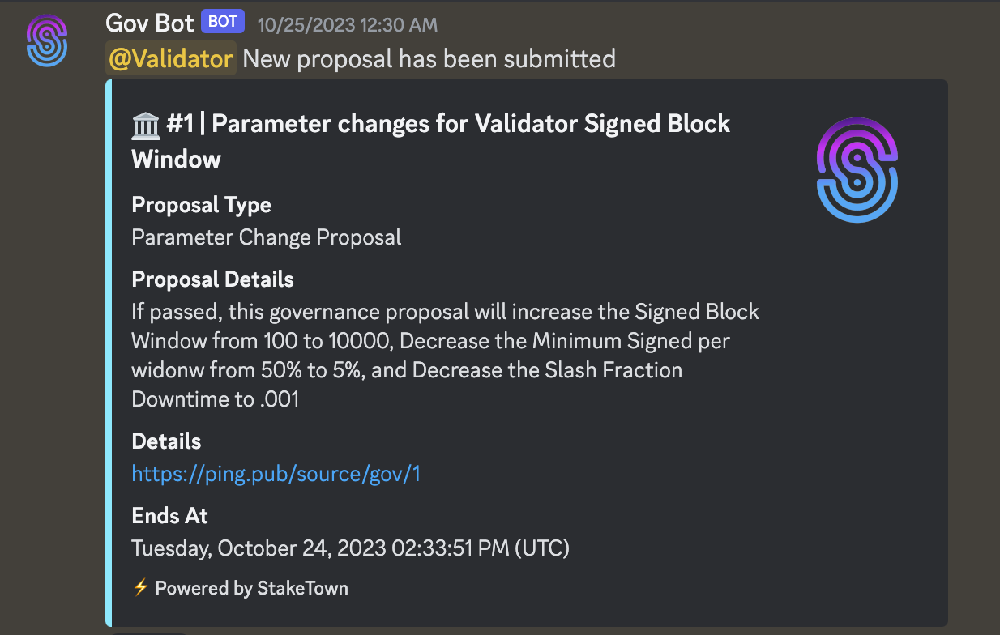

# Discord Governance On-chain bot

## Introduction
We provide discord governance bot that can post on-chain proposals right to you specific discord channel with
notifying all interested in that people using tags.

## Chains integrated
* [Elys Network](/docs/testnet/elys)
* [Source Protocol](/docs/mainnet/source)

## How it works

The bot scans network on existence of new proposals and post over webhook to provided 
channel new one that wasn't posted before. It's fully self-management bot as we use our RPC 
endpoints to provide this service in chains there we validate.

## How to integrate?

Interested in integration such tool? Don't hesitate to contact us:

Email: **hello@stake-town.com** 
Discord: **hottochelli** 