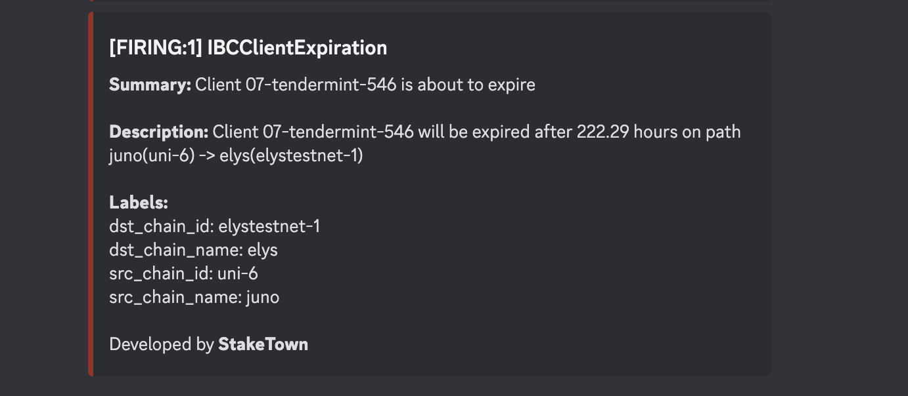

# IBC Monitoring

## Introduction
Monitoring tools that tracks stuck packets, acknowledgements and clients expiration and notify 
about any of above incidents for each path that is being tracked to discord channel.

## Chains integrated
* [Celestia](/docs/mainnet/celestia)
* [Umee](/docs/mainnet/umee)

## How it works

We provide ibc monitoring tool based on custom ibc exporter, prometheus and alertmanager that post
about any incidents trigger with specified rules over provided discord webhook to specified channel.
Tool tracks the following:
 - client is about to be expired (less than 20h) on any chain of ibc path;
 - client has been expired;
 - stuck acknowledgements on any channel of ibc path;
 - stuck packets on any channel of ibc path;

 

## How to integrate?

Interested in integration such tool? Don't hesitate to contact us:

Email: **hello@stake-town.com** 
Discord: **hottochelli** 